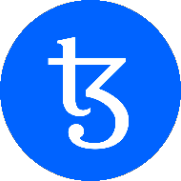

# Creating a Simple dApp on Tezos

In this tutorial, you will discover how to configure and establish a decentralized web application on Tezos. Together, we will fabricate an interface for the Liquidity Baking smart contract that will enable us to engage with this DEX and execute various tasks, such as exchanging tokens or delivering liquidity. Concurrently, you will be familiarized with fundamental concepts involved in creating a decentralized application, not only generally, but also particularly on Tezos.

Since the dapp will be created using [TypeScript](https://www.typescriptlang.org/), a comprehensive understanding of this programming language is essential. To develop the application, we will employ the [Svelte](https://svelte.dev/) framework, which is fairly intuitive to use and I will provide explanations throughout the process.

Like 99% of the dapps in the ecosystem, this dapp will depend on [Taquito](https://tezostaquito.io/), a TypeScript library that guarantees a superior developer experience when interacting with the Tezos blockchain.


### The Liquidity Baking contract

Tezos boasts a remarkable contract that's exclusively designed for decentralized exchange (DEX), called the Liquidity Baking contract. This DEX manages only three tokens: XTZ (the native token of Tezos), tzBTC (a wrapped token for Bitcoin on Tezos), and SIRS (the token that denotes an equal liquidity amount in XTZ and tzBTC supplied to the contract).

This contract holds a unique attribute, that is, each time a new block is baked on Tezos, 2.5 XTZ are injected into the contract. Users are anticipated to bring in tzBTC to maintain the DEX liquidity balance and the SIRS price stability.

Moreover, the contract is entirely public, enabling anyone with a Tezos wallet to interact with it for exchanging XTZ for tzBTC and vice-versa, adding or removing liquidity. And this is what we'll be accomplishing together in this tutorial.

### What are we going to build?

In this tutorial, we will build a dapp interface that interacts with the LB contract to swap tokens, add liquidity and remove it.

```admonish tip title="The dapp will handle different actions"
- Displaying users’ information like their XTZ, tzBTC, and SIRS balance and update them after each transaction.
- Connecting and disconnecting the users’ wallet.
- Displaying wallet information like its connection status and the network it’s connected to.
- Displaying different interfaces to swap tokens, add and remove liquidity.
- Allowing users to swap XTZ for tzBTC and tzBTC for XTZ.
- Allowing users to add liquidity by providing XTZ and tzBTC and getting SIRS in exchange.
- Allowing users to remove liquidity, i.e. to redeem SIRS tokens and get XTZ and tzBTC tokens in exchange.
```

Take a look at this flow chart to visual the flow of actions in dapp:
```
  +-----------------------+
  |                       |
  |    Main Dashboard  	  |
  |                       |
  +-----------------------+
              |
              | Wallet Connection
              |
  +-----------------------+
  |                       |
  |   Wallet Information  |
  |                       |
  +-----------------------+
              |
              | Token Swap or Liquidity Provision/Removal
              |
  +-----------------------+
  |                       |
  |   Tezos Blockchain    |
  |                       |
  +-----------------------+
              |
              | Transaction Execution
              |
  +-----------------------+
  |                       |
  |    Balance Update     |
  |                       |
  +-----------------------+
              |
              | Wallet Disconnection
              |
  +-----------------------+
  |                       |
  |   End of Transaction  |
  |                       |
  +-----------------------+
```

```admonish info title = "Repository"
Before we dive into creating the decentralized web application, the GitHub repository for this project is available for you to access, if you want to play around. You can find it [here](https://github.com/claudebarde/tezos-dev-portal-tutorial). With that said, let's move forward and start building our application step-by-step.
```

[Next Page →](/tutorials/page-1.1.md)
