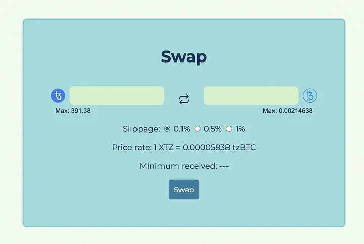

# Swapping tokens

### Designing the UI

Regarding swapping XTZ and tzBTC, we aim to UI to look something like this:



There are 2 text inputs, the one on the left is editable and will let the user input the amount of XTZ or tzBTC they want to exchange and the one on the right will be disabled and will display the corresponding amount they’ll get in the other token. The button in the middle with the 2 arrows will allow the user to switch the input between XTZ and tzBTC.

Going into the details of how the text inputs are implemented would go beyond the scope of this tutorial, but you can have a look at it in the `UserInput.svelte` file.

### Handling user input

Each input with its token icon and max field is the same component, the parent component tracks the position of each to update their UI accordingly. Internally, each input component keeps track of the user's input and the available balance to display error messages if the balance is too low. Each update in the input is dispatched to the parent component to adjust the general UI.

1. Make sure the `SwapView.svelte` file looks something like this:

```TS
<script lang="ts">
  ... your TypeScript code
</script>

<style lang="scss">
   ... your SASS code
</style>

... your HTML code
```

Import the following libraries and components inside the `<script>` tag:

``` TS
  import { onMount } from "svelte";
  import UserInput from "./UserInput.svelte";
  import { type token, TxStatus } from "../types";
  import {
    xtzToTokenTokenOutput,
    tokenToXtzXtzOutput,
    calcSlippageValue
  } from "../lbUtils";
  import store from "../store";
  import { displayTokenAmount, fetchBalances, calcDeadline } from "../utils";
  import { dexAddress, tzbtcAddress, XTZ, tzBTC } from "../config";
```

Below this, also declare these variables:

```TS
  let tokenFrom: token = "XTZ";
  let tokenTo: token = "tzBTC";
  let inputFrom = "";
  let inputTo = "";
  let minimumOutput = 0;
  let xtzToTzbtc = 0;
  let tzbtcToXtz = 0;
  let slippage: "0.1" | "0.5" | "1" = "0.1";
  let insufficientBalance = false;
  let resetInputs = false;
  let swapStatus = TxStatus.NoTransaction;
```

Also don't forget to include the `onMount` function we created previous and the end of the `<script>`.

2. Every time an update is sent to the parent component (SwapView.svelte), the data provided with the update is passed to the saveInput. This is achieved by the follow in the `SwapView.svelte` file:

```TS
const saveInput = ev => {
  const { token, val, insufficientBalance: insufBlnc } = ev.detail;
  insufficientBalance = insufBlnc;
  if (token === tokenFrom && val > 0) {
    inputFrom = val.toString();
    inputTo = "";
    if (tokenFrom === "XTZ") {
      // calculates tzBTC amount
      let tzbtcAmount = xtzToTokenTokenOutput({
        xtzIn: val * 10 ** XTZ.decimals,
        xtzPool: $store.dexInfo.xtzPool,
        tokenPool: $store.dexInfo.tokenPool
      });
      if (tzbtcAmount) {
        inputTo = tzbtcAmount.dividedBy(10 ** tzBTC.decimals).toPrecision(6);
      }
      // calculates minimum output
      minimumOutput = calcSlippageValue("tzBTC", +inputTo, +slippage);
    } else if (tokenFrom === "tzBTC") {
      // calculates XTZ amount
      let xtzAmount = tokenToXtzXtzOutput({
        tokenIn: val * 10 ** tzBTC.decimals,
        xtzPool: $store.dexInfo.xtzPool,
        tokenPool: $store.dexInfo.tokenPool
      });
      if (xtzAmount) {
        inputTo = xtzAmount.dividedBy(10 ** XTZ.decimals).toPrecision(8);
      }
      // calculates minimum output
      minimumOutput = calcSlippageValue("XTZ", +inputTo, +slippage);
    }
  } else {
    inputFrom = "";
    inputTo = "";
  }
};
```
```admonish tip title="What are these?"
- The values necessary for the calculations of the token amounts are destructured from the `ev.detail` object.
- The function verifies that the values are received from the token that is currently active (the one on the left).
- If that token is XTZ, the amount in tzBTC is calculated via the `xtzToTokenTokenOutput` function (more on that below).
- If that token is tzBTC, the amount in XTZ is calculated via the `tokenToXtzXtzOutput` function (more on that below).
- The minimum amount to be expected according to the slippage set by the user is calculated by the `calcSlippage` function.
```

```admonish
The “slippage” refers to the percentage that the user accepts to lose during the trade, a loss of tokens can happen according to the state of the liquidity pools. For example, if 100 tokens A can be swapped for 100 tokens B with a slippage of 1%, it means that you will receive between 99 and 100 tokens B.
```

### Exchanging XTZ for tzBTC for XTZ

Both `xtzToTokenTokenOutput` and `tokenToXtzXtzOutput` are an aadaptation fro this [repository](https://github.com/kukai-wallet/kukai-dex-calculations) which will allow us to calculate how many tzBTC a user will get according to the XTZ amount they input and vice-versa.

1. This is achieved using this function:

```TS
export const xtzToTokenTokenOutput = (p: {
  xtzIn: BigNumber | number;
  xtzPool: BigNumber | number;
  tokenPool: BigNumber | number;
}): BigNumber | null => {
  let { xtzIn, xtzPool: _xtzPool, tokenPool } = p;
  let xtzPool = creditSubsidy(_xtzPool);
  let xtzIn_ = new BigNumber(0);
  let xtzPool_ = new BigNumber(0);
  let tokenPool_ = new BigNumber(0);
  try {
    xtzIn_ = new BigNumber(xtzIn);
    xtzPool_ = new BigNumber(xtzPool);
    tokenPool_ = new BigNumber(tokenPool);
  } catch (err) {
    return null;
  }
  if (
    xtzIn_.isGreaterThan(0) &&
    xtzPool_.isGreaterThan(0) &&
    tokenPool_.isGreaterThan(0)
  ) {
    const numerator = xtzIn_.times(tokenPool_).times(new BigNumber(998001));
    const denominator = xtzPool_
      .times(new BigNumber(1000000))
      .plus(xtzIn_.times(new BigNumber(998001)));
    return numerator.dividedBy(denominator);
  } else {
    return null;
  }
};
```
The `xtzToTokenTokenOutput` function requires 3 values to calculate an output in tzBtc from an input in XTZ: the said amount in XTZ (`xtzIn`), the state of the XTZ pool in the contract (`xtzPool`) and the state of the SIRS pool (`tokenPool`). Most of the modifications made to the original functions apply to the use of BigNumber in order to make it work more smoothly with Taquito. The function then returns the corresponding amount in tzBTC or `null` if an error occurs.

2. The same for the `tokenToXtzXtzOutput`:

```TS
export const tokenToXtzXtzOutput = (p: {
  tokenIn: BigNumber | number;
  xtzPool: BigNumber | number;
  tokenPool: BigNumber | number;
}): BigNumber | null => {
  const { tokenIn, xtzPool: _xtzPool, tokenPool } = p;
  let xtzPool = creditSubsidy(_xtzPool);
  let tokenIn_ = new BigNumber(0);
  let xtzPool_ = new BigNumber(0);
  let tokenPool_ = new BigNumber(0);
  try {
    tokenIn_ = new BigNumber(tokenIn);
    xtzPool_ = new BigNumber(xtzPool);
    tokenPool_ = new BigNumber(tokenPool);
  } catch (err) {
    return null;
  }
  if (
    tokenIn_.isGreaterThan(0) &&
    xtzPool_.isGreaterThan(0) &&
    tokenPool_.isGreaterThan(0)
  ) {
    let numerator = new BigNumber(tokenIn)
      .times(new BigNumber(xtzPool))
      .times(new BigNumber(998001));
    let denominator = new BigNumber(tokenPool)
      .times(new BigNumber(1000000))
      .plus(new BigNumber(tokenIn).times(new BigNumber(999000)));
    return numerator.dividedBy(denominator);
  } else {
    return null;
  }
};
```

After the corresponding amount of XTZ or tzBTC is calculated according to the inputs of the user, the UI unlocks and is ready for a swap.

### Creating a swap transaction:

Swapping the tokens is pretty intensive as they are multiple moving parts that must play in unison. 

Describing step by step what happens after the user clicks on the Swap button, this function:

```TS
const swap = async () => {
  try {
    if (isNaN(+inputFrom) || isNaN(+inputTo)) {
      return;
    }
  
  ...
  } catch (error) {
    console.log(error);
    swapStatus = TxStatus.Error;
    store.updateToast(true, "An error has occurred");
  }
};
```

The swap function is triggered when the user clicks the Swap button. The first thing to do is to check if there is a valid value for `inputFrom`, i.e. the token that the user wants to exchange (XTZ or tzBTC), and a valid value for inputTo, i.e. the token that the user will receive. There is no point in going further if those two values are not set properly.

Next, you update the UI in order to show the user that the transaction is getting ready:

```TS
enum TxStatus {
  NoTransaction,
  Loading,
  Success,
  Error
}

swapStatus = TxStatus.Loading;
store.updateToast(true, "Waiting to confirm the swap...");
const lbContract = await $store.Tezos.wallet.at(dexAddress);
const deadline = calcDeadline();
```

This creates an enum to represent the status of the transaction (available in the `type.ts` file) and you update the `swapStatus` variable responsible for updating the UI and blocking the inputs. The store is also updated with the updateToast() method to get a simple toast to show up in the interface.

Afterwards, it creates the `ContractAbstraction` from Taquito in order to interact with the DEX and you also calculate the deadline.

```admonish
The Liquidity Baking contract expects you to pass a deadline for the swap, the transaction will be rejected if the deadline is expired.
```

### Swapping tzBTC for XTZ

There are 2 use ases where you'd like the user to select either XTZ or tzBTC as the token to swap. 

1. Firstly looking at tzBTC to XTZ, we can use the following function:

```TS
if (tokenFrom === "tzBTC") {
  const tzBtcContract = await $store.Tezos.wallet.at(tzbtcAddress);
  const tokensSold = Math.floor(+inputFrom * 10 ** tzBTC.decimals);
  let batch = $store.Tezos.wallet
    .batch()
    .withContractCall(tzBtcContract.methods.approve(dexAddress, 0))
    .withContractCall(
    tzBtcContract.methods.approve(dexAddress, tokensSold)
    )
    .withContractCall(
    lbContract.methods.tokenToXtz(
        $store.userAddress,
        tokensSold,
        minimumOutput,
        deadline
      )
    )
    .withContractCall(tzBtcContract.methods.approve(dexAddress, 0));
  const batchOp = await batch.send();
  await batchOp.confirmation();
}
```
The major difference between swapping XTZ to tzBTC and swapping tzBTC to XTZ is that the latter requires 3 additional operations: 

- One to set the current permission for the LB DEX (if any) to zero.
- One to register the LB DEX as an operator within the tzBTC contract with the amount of tokens that it is allowed to spend on behalf of the user.
- One to set this amount back to zero and avoid later uses of the given permission.

How this works is that:

- You call the `batch()` method present on the `wallet` or `contract` property of the instance of the `TezosToolkit`.

- This returns a batch instance with different methods that you can use to create transactions, in our example, `withContractCall()` is a method that will add a new contract call to the batch of operations.

- As a parameter for `withContractCall()`, you pass the contract call as if you would call it on its own, by using the name of the entrypoint on the methods property of the `ContractAbstraction`.

- Therefore you batch 1 operation to set the permission of the LB DEX within the tzBTC contract to zero, 1 operation to approve the amount required by the swap, 1 operation to confirm the swap within the LB DEX contract, and 1 operation to set the permission of the LB DEX back to zero.

- On the returned batch, you call the `.send()` method to forge the transaction, sign it and send it to the Tezos mempool, which returns an operation.

- You can `await` the confirmation of the transaction by calling `.confirmation()` on the operation returned in the step above.

```admonish
The penultimate transaction: the tokenToXtz entrypoint of the LB contract requires 4 parameters.
```

After the transaction is sent by calling the `.send()` method, it calls `.confirmation()` on the operation object to wait for one confirmation (which is the default if you don't pass a parameter to the method).

### Swapping XTZ to tzBTC

The `xtzToToken` entrypoint takes 3 parameters:

- The address of the account that will receive the tzBTC tokens
- The expected amount of tzBTC to be received
- The deadline

Therefore using the following code will allow for it easily swapp the currencies:

```TS
const op = await lbContract.methods
  .xtzToToken($store.userAddress, minimumOutput, deadline)
  .send({ amount: +inputFrom });
await op.confirmation();
```
In addition to that, you have to attach the right amount of XTZ to the transaction. This can be achieved very easily with Taquito.

```admonish
The `.send()` method that you call on the output of the entrypoint call? If you didn't know, you can pass parameters to this method, one of the most important ones is an `amount` of XTZ to send along with the transaction. Just pass an object with an amount property and a value of the amount of tez you want to attach, and that's it!
```

Just like any other transaction, you get an operation object and call `.confirmation()` on it to wait for the operation to be included in a new block.


### Updating the UI

Giving the user any indiation of a sucessful or not transaction is crucial feedback. 

If the swap succeeded, it will fetch the user’s new balances and provide visual feedback:

```TS
const res = await fetchBalances($store.Tezos, $store.userAddress);
if (res) {
  store.updateUserBalance("XTZ", res.xtzBalance);
  store.updateUserBalance("tzBTC", res.tzbtcBalance);
  store.updateUserBalance("SIRS", res.sirsBalance);
} else {
  store.updateUserBalance("XTZ", null);
  store.updateUserBalance("tzBTC", null);
  store.updateUserBalance("SIRS", null);
}
// visual feedback
store.updateToast(true, "Swap successful!");
```

If the sway failed, it will redirect to the `catch` branch where you also have to provide visual feedback and update the UI:

```TS
swapStatus = TxStatus.Error;
store.updateToast(true, "An error has occurred");
```

Setting swapStatus to TxStatus.Error will remove the loading interface you set during the swap before you display a toast to indicate that the transaction failed.


Lastly, the `finally` branch will reset the UI after period of time. In this case 3 seconds:

```TS
finally {
  setTimeout(() => {
    swapStatus = TxStatus.NoTransaction;
    store.showToast(false);
  }, 3000);
}
```
```admonish tip title="Design considerations>"

- Structure your code into distinct steps, such as updating the UI, forging the transaction, emitting the transaction, and updating the UI again.
- Provide visual feedback to users, such as a spinner or loading animation, to indicate that the app is processing their request.
- Disable the UI while the transaction is in progress to prevent confusion and unexpected behavior. Users should not be able to initiate multiple transactions at once.
- Reset the UI to its original state once the transaction is complete, to avoid confusing the user and make sure the interface is consistent.
```

[← Previous Page](/tutorials/page-1.2.md)

[Next Page →](/tutorials/page-1.4.md)