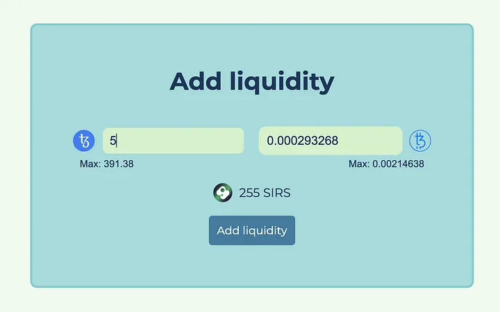

# Adding and removing liquidity

The most complex part of this tutorial about adding liquidity to the Liquidity Baking contract is to get the amounts of tokens right.

The LB DEX gives you the ability to provide a pair of tokens (only 2 choices here, XTZ and tzBTC) as liquidity to enable the swapping feature. In exchange, you get SIRS tokens to represent your investment. These tokens increase in value over time, so if you wait long enough, you can make a profit when you remove your liquidity, which will be explained down below.

We aiming for the UI to look similar to the swapping interface, with a few difference:



Like before, we have 2 input fields, but this time, there is no middle button to switch between the 2 tokens and both inputs are editable.

When inputting a number in one of the fields, the dapp must calculate the corresponding amount of the other token, as well as the expected amount in SIRS that will be received.

### Converting the input

When the user is going to input a number in one of the fields, the input will dispatch a new event to the interface component with the name of the token involved and the amount that was input.

1. Make sure the `AddLiquidity.svelte` file looks something like this:

```TS
<script lang="ts">
  ... your TypeScript code
</script>

<style lang="scss">
   ... your SASS code
</style>

... your HTML code
```

Import the following libraries and components inside the `<script>` tag:

``` TS
  import { OpKind } from "@taquito/taquito";
  import store from "../store";
  import UserInput from "./UserInput.svelte";
  import { type token, TxStatus } from "../types";
  import {
    addLiquidityTokenIn,
    tokenToXtzXtzOutput,
    addLiquidityLiquidityCreated
  } from "../lbUtils";
  import { dexAddress, tzbtcAddress, XTZ, tzBTC } from "../config";
  import { calcDeadline, fetchBalances } from "../utils";
```

Below this, also declare these variables:

```TS
  let inputXtz = "";
  let inputTzbtc = "";
  let sirsOutput = 0;
  let addLiquidityStatus = TxStatus.NoTransaction;
  let resetXtzInput = false;
  let resetTzbtcInput = false;

  let swapStatus = TxStatus.NoTransaction;
```

Also don't forget to include the `onMount` function we created previous and the end of the `<script>`.


2. This data will be read by the `saveInput` function. By adding the following function:

```TS
const saveInput = ev => {
    const { token, val }: { token: token; val: number | null } = ev.detail;
    ...
}
```

3. Then, we will introduce a condition based on the token because the calculations will be different to convert an amount of XTZ into tzBTC and vice-versa. 

Starting with XTZ, inside the `saveInput` function:

```TS
if (token === "XTZ" && val && val > 0) {
  inputXtz = val.toString();
  let tzbtcAmount = addLiquidityTokenIn({
    xtzIn: val * 10 ** 6,
    xtzPool: $store.dexInfo.xtzPool,
    tokenPool: $store.dexInfo.tokenPool
  });
  if (tzbtcAmount) {
    inputTzbtc = tzbtcAmount.dividedBy(10 ** 8).toPrecision(6);
  } else {
    inputTzbtc = "";
  }
  ...
}
```

The condition also includes a check for the value, as there is no need to process it if the value is `nul`l or `0`.

4. The value is cast to a string and stored in the `inputXtz` variable to be used later. The corresponding amount of tzBTC is calculated with the `addLiquidityTokenIn` function.

For calculating the different token amounts for the LB DEX, we'll following under the `saveInput` function:

```TS
const addLiquidityTokenIn = (p: {
  xtzIn: BigNumber | number;
  xtzPool: BigNumber | number;
  tokenPool: BigNumber | number;
}): BigNumber | null => {
  const { xtzIn, xtzPool, tokenPool } = p;
  let xtzIn_ = new BigNumber(0);
  let xtzPool_ = new BigNumber(0);
  let tokenPool_ = new BigNumber(0);
  try {
    xtzIn_ = new BigNumber(xtzIn);
    xtzPool_ = creditSubsidy(xtzPool);
    tokenPool_ = new BigNumber(tokenPool);
  } catch (err) {
    return null;
  }
  if (
    xtzIn_.isGreaterThan(0) &&
    xtzPool_.isGreaterThan(0) &&
    tokenPool_.isGreaterThan(0)
  ) {
    return ceilingDiv(xtzIn_.times(tokenPool_), xtzPool_);
  } else {
    return null;
  }
};
```

This checks the output of addLiquidityTokenIn and we update the inputTzbtc variable.

5. If the user inputs an amount in tzBTC, the steps will be very similar to calculate the corresponding amount in XTZ. Back inside the `saveInput` function add:

```TS
else if (token === "tzBTC" && val && val > 0) {
  inputTzbtc = val.toString();
  let xtzAmount = tokenToXtzXtzOutput({
    tokenIn: val * 10 ** 8,
    xtzPool: $store.dexInfo.xtzPool,
    tokenPool: $store.dexInfo.tokenPool
  });
  if (xtzAmount) {
    inputXtz = xtzAmount.dividedBy(10 ** 6).toPrecision(8);
    ...
  } else {
    inputXtz = "";
  }
}
```

6. We also need to check that the provided value is correct, after what we use the `tokenToXtzXtzOutput` function to get the corresponding amount of XTZ to create a valid pair and provide liquidity.

We'll use the following function called `tokenToXtzOutput`:

```TS
const tokenToXtzXtzOutput = (p: {
  tokenIn: BigNumber | number;
  xtzPool: BigNumber | number;
  tokenPool: BigNumber | number;
}): BigNumber | null => {
  const { tokenIn, xtzPool: _xtzPool, tokenPool } = p;
  let xtzPool = creditSubsidy(_xtzPool);
  let tokenIn_ = new BigNumber(0);
  let xtzPool_ = new BigNumber(0);
  let tokenPool_ = new BigNumber(0);
  try {
    tokenIn_ = new BigNumber(tokenIn);
    xtzPool_ = new BigNumber(xtzPool);
    tokenPool_ = new BigNumber(tokenPool);
  } catch (err) {
    return null;
  }
  if (
    tokenIn_.isGreaterThan(0) &&
    xtzPool_.isGreaterThan(0) &&
    tokenPool_.isGreaterThan(0)
  ) {
    let numerator = new BigNumber(tokenIn)
      .times(new BigNumber(xtzPool))
      .times(new BigNumber(998001));
    let denominator = new BigNumber(tokenPool)
      .times(new BigNumber(1000000))
      .plus(new BigNumber(tokenIn).times(new BigNumber(999000)));
    return numerator.dividedBy(denominator);
  } else {
    return null;
  }
};
```

Once this is calculated, we store the result in the `inputXtz` variable for later use.

### Calculating the expected amount of SIRS

Now, we have to calculate the corresponding amount of SIRS that will be created if inputXtz and inputTzbtc are provided as parameters to add liquidity.

1. The `addLiquidityLiquidityCreated` function does carries this out for us. Use the following code inside the `lbUtils.ts`:

```TS
const addLiquidityLiquidityCreated = (p: {
  xtzIn: BigNumber | number;
  xtzPool: BigNumber | number;
  totalLiquidity: BigNumber | number;
}): BigNumber | null => {
  const { xtzIn, xtzPool, totalLiquidity } = p;
  let xtzIn_ = new BigNumber(0);
  let xtzPool_ = new BigNumber(0);
  let totalLiquidity_ = new BigNumber(0);
  try {
    xtzIn_ = new BigNumber(xtzIn);
    xtzPool_ = new BigNumber(xtzPool);
    totalLiquidity_ = new BigNumber(totalLiquidity);
  } catch (err) {
    return null;
  }
  xtzPool_ = creditSubsidy(xtzPool_);

if (xtzIn_.isGreaterThan(0) && xtzPool_.isGreaterThan(0)) {
  if (totalLiquidity_.isEqualTo(0)) {
    return new BigNumber(xtzIn)
    .times(new BigNumber(totalLiquidity))
    .dividedBy(new BigNumber(xtzPool));
  } else if (totalLiquidity_.isGreaterThan(0)) {
    return new BigNumber(xtzIn)
    .times(new BigNumber(totalLiquidity))
    .dividedBy(new BigNumber(xtzPool));
  }
    return null;
  } else {
    return null;
  }
};
```

```admonish tip title="What are these?"
This function looks at 3 parameters:

- The amount of XTZ you want to add as liquidity
- The current state of the XTZ pool
- The total amount of liquidity available in the contract (i.e. the SIRS tokens)
```

It will output the amount of SIRS created after the transaction. This amount is stored in the `sirsOutput` variable to be displayed in the interface.

### Sending the tokens

After we calculated all the values we need to add liquidity to the Liquidity Baking contract.

1. Back in the `AddLiquidityView.svelte` file, add this new function:

```TS
const addLiquidity = async () => {
  try {
    if (inputXtz && inputTzbtc && sirsOutput) {
      addLiquidityStatus = TxStatus.Loading;
      store.updateToast(
        true,
        "Adding liquidity, waiting for confirmation..."
      );
      const tzbtcForLiquidity = Math.floor(
        +inputTzbtc * 10 ** tzBTC.decimals
      );
      const lbContract = await $store.Tezos.wallet.at(dexAddress);
      const tzBtcContract = await $store.Tezos.wallet.at(tzbtcAddress);
    ...
}
```

We need check that the 3 values we need, the amounts of XTZ, tzBTC, and SIRS are available. If it is the case, we update the UI by switching the `addLiquidityStatus` variable to `TxStatus.Loading` and by displaying a simple toast with a message.

After that, we convert the amount of tzBTC we got into its “real” value, i.e. the value without decimal points as stored in its contract.

Then, we create the `ContractAbstraction` for the LB DEX and the `ContractAbstraction` for the tzBTC contract, as we will interact with both.

```admonish info
Every time your users want to use tzBTC with the LB DEX, the amount of tokens that will be used needs to be approved at the tzBTC contract level, which requires 3 different operations.
```
Now we need to create a batched transaction, howver we'll do it differently to the previous section of this tutorial for variation. Here's an example of how this can be carried out:

```TS
const batch = $store.Tezos.wallet.batch([
  {
    kind: OpKind.TRANSACTION,
    ...tzBtcContract.methods.approve(dexAddress, 0).toTransferParams()
  }, // is the transaction required to set the amount of approved tzBTC for the LB DEX to zero.
  {
    kind: OpKind.TRANSACTION,
    ...tzBtcContract.methods
    .approve(dexAddress, tzbtcForLiquidity)
    .toTransferParams()
  }, // sets the amount of approved tzBTC for the LB DEX contract.
  {
    kind: OpKind.TRANSACTION,
    ...lbContract.methodsObject
    .addLiquidity({
      owner: $store.userAddress,
      minLqtMinted: sirsOutput,
      maxTokensDeposited: tzbtcForLiquidity,
      deadline: calcDeadline()
    })
    .toTransferParams(),
    amount: +inputXtz
  }, // sets the amount of approved tzBTC for the LB DEX contract, with 4 paarameters
  {
    kind: OpKind.TRANSACTION,
    ...tzBtcContract.methods.approve(dexAddress, 0).toTransferParams()
  } // resets the allowed amount of tzBTC to be used by the LB DEX to zero
]);

const batchOp = await batch.send();
await batchOp.confirmation();
```

In the previous chapter, the batched transaction was created using the `withContractCall` method available on the `batch`method. Here, we will actually pass a parameter to the `batch()` method, an array containing multiple objects that each represent an operation.

Like any other transaction forged through Taquito, you call `.send()` and `.confirmation()` on the operation object to wait for one confirmation.

Once the transaction is confirmed, you clear the UI before fetching the new balances of XTZ, tzBTC, and SIRS.

To update the UI to provide visual feedback, we can add the following to the end of funcction that is fetching the user's XTZ, tzBTC and SIRS balances:

```TS
addLiquidityStatus = TxStatus.Error;
store.updateToast(true, "An error has occurred");
```

Also using the 3 seconds timeout would be useful:

```TS
setTimeout(() => {
  addLiquidityStatus = TxStatus.NoTransaction;
  store.showToast(false);
}, 3000);
```

```admonish success title=""
The user now has the ability to add liquidity to the Liquidity Baking DEX and invest their XTZ and tzBTC.
```

### Removing liquidity

Removing liquidity from the Liquidity Baking contract is arguably the easiest of all the tasks accomplished by our interface. The interface only needs one input to receive the amount of SIRS that the user wants to unwrap to get XTZ and tzBTC.

The dapp will then calculate the corresponding amount of XTZ and tzBTC expected to be received for the amount of SIRS in the input field.

1. Inside the `lbUtils.ts` file, we can create `removeLiquidityXtzTzbtcOut` function to calculate these amounts. 

Using the following will help achieve this:

```TS
const outputRes = removeLiquidityXtzTzbtcOut({
  liquidityBurned: val, // the amount of SIRS to burn
  totalLiquidity: $store.dexInfo.lqtTotal.toNumber(), // the total amount of SIRS tokens in the contract
  xtzPool: $store.dexInfo.xtzPool.toNumber(), // the total amount of XTZ tokens in the contract
  tokenPool: $store.dexInfo.tokenPool.toNumber() // the total amount of tzBTC tokens in the contract
});
if (outputRes) {
  const { xtzOut, tzbtcOut } = outputRes;
  xtzOutput = xtzOut
    .decimalPlaces(0, 1)
    .dividedBy(10 ** 6)
    .decimalPlaces(6)
    .toNumber();
  tzbtcOutput = tzbtcOut
    .decimalPlaces(0, 1)
    .dividedBy(10 ** 8)
    .decimalPlaces(8)
    .toNumber();
}
```

If the function has been able to calculate the amounts of XTZ and tzBTC, they are returned in an object, otherwise `null`is returned. After that, those amounts can be displayed in the interface.

Now, we must implement a way to interact with the `removeLiquidity` entrypoint of the contract. 

1. Make sure the `RemoveLiquidityView.svelte` file looks something like this:

```TS
<script lang="ts">
  ... your TypeScript code
</script>

<style lang="scss">
   ... your SASS code
</style>

... your HTML code
```

Import the following libraries and components inside the `<script>` tag:

``` TS
  import store from "../store";
  import UserInput from "./UserInput.svelte";
  import { removeLiquidityXtzTzbtcOut } from "../lbUtils";
  import { TxStatus } from "../types";
  import { calcDeadline, fetchBalances } from "../utils";
  import { dexAddress, XTZ, tzBTC } from "../config";
```

Below this, also declare these variables:

```TS
  let inputSirs = "";
  let xtzOutput = 0;
  let tzbtcOutput = 0;
  let resetInput = false;
  let removeLiquidityStatus = TxStatus.NoTransaction;
```

Also don't forget to include the `onMount` function we created previous and the end of the `<script>`.

```admonish info
The file should also have the `saveInput` function as this will be retaining the data that we'll be removing.
```

2. First, we create a removeLiquidity function within our TypeScript code that will be triggered when the user clicks on the Remove liquidity button:

```TS
const removeLiquidity = async () => {
  try {
  if (inputSirs) {
    removeLiquidityStatus = TxStatus.Loading;
    store.updateToast(
      true,
      "Removing liquidity, waiting for confirmation..."
    );
    const lbContract = await $store.Tezos.wallet.at(dexAddress);
          
  ...
};
```

The function starts by checking if there is an amount of SIRS that was input before the remove liquidity action was triggered. If that’s the case, the `removeLiquidityStatus` is set to `loading` to update the UI and inform the user that the transaction is getting ready. A toast will also be displayed.

Then `ContractAbstraction` is created for the LB DEX in order to interact with it from Taquito.

3. Now we can forge the actual transaction by also adding:

```TS
const op = await lbContract.methodsObject
  .removeLiquidity({
    to: $store.userAddress, //  the account that will receive the XTZ and tzBTC
    lqtBurned: inputSirs, // the amount of SIRS to burn
    minXtzWithdrawn: Math.floor(xtzOutput * 10 ** XTZ.decimals), // the minimum amount of XTZ expected to be received
    minTokensWithdrawn: Math.floor(tzbtcOutput * 10 ** tzBTC.decimals), // the minimum amount of tzBTC expected to be received
    deadline: calcDeadline() //  just as the other entrypoint, a deadline for the transaction must be provided
  })
  .send();
await op.confirmation();
```

After the transaction has been emitted, we call .confirmation() on the operation object returned by Taquito.

4. Similar to before, if transaction was successful, we update the UI and reset the token values:

```TS
removeLiquidityStatus = TxStatus.Success;
inputSirs = "";
xtzOutput = 0;
tzbtcOutput = 0;
// fetches user's XTZ, tzBTC and SIRS balances
const res = await fetchBalances($store.Tezos, $store.userAddress);
if (res) {
  store.updateUserBalance("XTZ", res.xtzBalance);
  store.updateUserBalance("tzBTC", res.tzbtcBalance);
  store.updateUserBalance("SIRS", res.sirsBalance);
} else {
  store.updateUserBalance("XTZ", null);
  store.updateUserBalance("tzBTC", null);
  store.updateUserBalance("SIRS", null);
}
store.updateToast(true, "Liquidity successfully removed!");
```

If it fails:

```TS
removeLiquidityStatus = TxStatus.Error;
store.updateToast(true, "An error has occurred");
```

```admonish success title=""
And that’s it, the users have now the possibility to remove SIRS tokens and get XTZ and tzBTC tokens in exchange!
```

[← Previous Page](/tutorials/page-1.3.md)

[Next Page →](/tutorials/page-1.5.md)